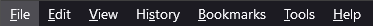

How to use Toggle Native Tab Bar
================================


Here are some instructions on how to use this extension...

(REQUIRED) Enabling userChrome.css (Skip this section if you already use userChrome.css)
----------------------------------------------------------------------------------------

*   First, go to "about:config" and set "toolkit.legacyUserProfileCustomizations.stylesheets = TRUE" to enable userChrome.css usage
*   Next, go to "about:profiles" and look for the profile that says "This is the profile in use and it cannot be deleted"
*   On the row for "Root Directory", click on "Open Folder" to open the profile folder in your file manager
*   Inside the profile folder, create a new folder called "chrome" if it doesn't exist
*   Inside the "chrome" folder, create a new file called "userChrome.css" if it doesn't exist
    *   Make sure you do not create the file as userChrome.css.txt

(REQUIRED) Entering CSS to hide or show the native tab bar into userChrome.css
------------------------------------------------------------------------------

*   Add the following text to your userChrome.css file:

```
#main-window #titlebar { overflow: hidden; transition: height 0.3s 0.3s !important; } /* Hidden state: Hide native tabs strip */
#main-window[titlepreface*=" "] #titlebar { height: 0 !important; } /* Hidden state: Fix z-index of active pinned tabs */ 
#main-window[titlepreface*=" "] #tabbrowser-tabs { z-index: 0 !important; }
```

*   This addon populate\\removes " " to the titlepreface property which is then acted on by your userChrome.css
*   Mozilla reference: [https://developer.mozilla.org/en-US/docs/Mozilla/Add-ons/WebExtensions/API/windows/update](https://developer.mozilla.org/en-US/docs/Mozilla/Add-ons/WebExtensions/API/windows/update)
*   Save your "userChrome.css" file and restart Firefox

(INFO) Here are some items to be aware of ...
---------------------------------------------

*   The addon icon will change based on if the tabs should be displayed or not
    *    -- This is what the addon icon will look like when the tabs should be displayed
    *    -- This is what the addon icon will look like when the tabs should be hidden

*   When the native tabs are hidden, you do not have direct access to the minimize\\maximize\\close buttons. Workarounds include:
    *   Use this addon to show the native tab bar again to get access to the native buttons
    *   Use the keyboard shortcuts (Alt+Space, N, X)
    *   Use the right-click context menu on the taskbar
    *   Use the Windows key + arrow keys to move the window around
    *   Download and use Firefox addons the emulate these functions and place on the toolbar
        *   Minimize: [https://addons.mozilla.org/en-US/firefox/addon/minimize-the-window/](https://addons.mozilla.org/en-US/firefox/addon/minimize-the-window/)
        *   Maximize: [https://addons.mozilla.org/en-US/firefox/addon/maximize-the-window/](https://addons.mozilla.org/en-US/firefox/addon/maximize-the-window/)
        *   Close: [https://addons.mozilla.org/en-US/firefox/addon/close-the-window/](https://addons.mozilla.org/en-US/firefox/addon/close-the-window/)
        *    -- These addons can virtually replace the native buttons

*   When the native tabs are hidden, you do not have direct access to Firefox's menu.
    *    -- This is the native Firefox menu
    *   Use this addon to show the native tab bar again, then press "ALT" to get access to Firefox's menu

*   The idea for this addon was inspired Sidebery's feature: Dynamic native tabs
    *   Dynamic native tabs: [https://github.com/mbnuqw/sidebery/wiki/Firefox-Styles-Snippets-(via-userChrome.css)#dynamic-native-tabs/](https://github.com/mbnuqw/sidebery/wiki/Firefox-Styles-Snippets-(via-userChrome.css)#dynamic-native-tabs)
    *   Sidebery is focused on if Sidebery is displayed or not, this addon just toggles the native bar
    *   This allows both the sidebar and native tab bar to be shown if you want
    *   This also allows a more generic implementation that could be used with other sidebar addons like Tree Style Tab

*   Atribution for base addon icon that I modified for this usage
    *   Icons made by [Freepik](https://www.flaticon.com/authors/freepik "Freepik") from [www.flaticon.com](https://www.flaticon.com/ "Flaticon")
