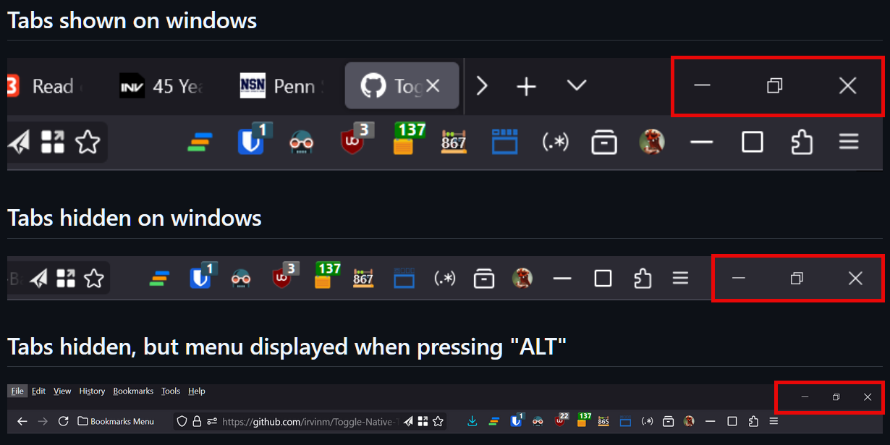

  

<!-- Can also get # of downloads per week:  https://img.shields.io/amo/dw/TST-Lock.svg?style=flat-square -->
<!-- Github badges:  https://shields.io/search?q=github -->
<!-- Mozilla badges:  https://shields.io/search?q=mozilla -->
<!-- https://shields.io/badges -->
<!-- https://github.com/badges/shields -->

How to use Toggle Native Tab Bar
================================


(REQUIRED) Enable userChrome.css in Firefox (Skip if already enabled)
----------------------------------------------------------------------------------------
1. In Firefox, type `about:config` into the address bar and press `Enter`.
2. Search for `toolkit.legacyUserProfileCustomizations.stylesheets` and set it to `TRUE` to enable custom stylesheets.
3. Next, type `about:profiles` into the address bar.
4. Find the profile labeled *"This is the profile in use and it cannot be deleted."*
5. In the same row, click **Open Folder** under *Root Directory* to access your profile folder.
6. In the profile folder, create a new folder named `chrome` (if it doesn’t already exist).
7. Inside the `chrome` folder, create a file named `userChrome.css` (ensure it’s not `userChrome.css.txt`).

These steps will enable custom styling with the `userChrome.css` file.

(REQUIRED) Enter CSS to hide or show the native tab bar in `userChrome.css`
---------------------------------------------

1. Open the `userChrome.css` file you created earlier in the `chrome` folder.
2. Add the one of these CSS solutions to the file:
    - Option #1 - Original:  Hide the native tab bar and use addons for min/max/close

   ```css
     #main-window[titlepreface*=" "] #TabsToolbar {
         display: none;
     }
   ```
     - Option #2 - New Alternative:  Hide the native tab bar and use Firefox native min/max/close buttons

   ```css
    #main-window[titlepreface*=" "] {
        #TabsToolbar {
            display: none;
        }

        #nav-bar {
            .titlebar-buttonbox-container {
                display: flex !important;
            }
        }
    }
   ```
    <div style="display: flex; align-items: center; margin-bottom: 10px; margin-top: 5px;">
        
    </div>
3. Save your userChrome.css file and restart Firefox to apply the changes.

**Explanation**
- This CSS targets TabsToolbar and hides the native tab bar when a certain condition is met.
- The condition is based on the titlepreface property, which this add-on manipulates by adding or removing a space (" ").

**Reference**
- You can refer to Mozilla’s documentation for more details: [MDN WebExtensions API - windows.update](https://developer.mozilla.org/en-US/docs/Mozilla/Add-ons/WebExtensions/API/windows/update)

(LIMITATION) Limited access to window control buttons when native tabs are hidden
---------------------------------------------

*   When the native tabs are hidden, the minimize, maximize, and close buttons are not directly accessible. Here are some workarounds:
    *   Use the new CSS solution to keep the Firefox native min/max/close buttons.
    *   Use this addon to temporarily show the native tab bar and regain access to the native window control buttons.
    *   Use keyboard shortcuts:
        *   `Alt+Space, N` for minimize
        *   `Alt+Space, X` for maximize
    *   Right-click the taskbar and use the context menu options.
    *   Use `Windows Key + Arrow Keys` to move and resize the window.
    *   Download and use Firefox addons that emulate the window control buttons and place them on the toolbar:
        *   [Minimize the Window](https://addons.mozilla.org/en-US/firefox/addon/minimize-the-window/)
        *   [Maximize the Window](https://addons.mozilla.org/en-US/firefox/addon/maximize-the-window/)
        *   [Close the Window](https://addons.mozilla.org/en-US/firefox/addon/close-the-window/)
        *    -- These addons can replace the native buttons.


(INFO) Addon icon
---------------------------------------------

*   The addon icon will change based on if the tabs should be displayed or not
    *   <div style="display: flex; align-items: center; margin-bottom: 10px; margin-top: 5px;">
            
            <span>This is what the addon icon will look like when the tabs should be displayed</span>
        </div>
    *   <div style="display: flex; align-items: center;">
            
            <span>This is what the addon icon will look like when the tabs should be hidden</span>
        </div>

Inspiration and credits
---------------------------------------------

*   This addon was inspired by Sidebery's *Dynamic Native Tabs* feature
    *   [Dynamic Native Tabs (Github Description)](https://github.com/mbnuqw/sidebery/wiki/Firefox-Styles-Snippets-(via-userChrome.css)#dynamic-native-tabs)
    *   While Sidebery focuses on whether its own sidebar is displayed, this addon toggles only the native tab bar.
    *   This allows both the sidebar and native tab bar to be shown simultaneously if desired.
    *   You do not even have to show your sidebar to use this addon.
    *   It also offers a more generic implementation that could work with other sidebar addons like *[Tree Style Tab](https://github.com/piroor/treestyletab)*.

*   Attribution for the base addon icon:
    *   Icons made by [Freepik](https://www.flaticon.com/authors/freepik "Freepik") from [www.flaticon.com](https://www.flaticon.com/ "Flaticon").
