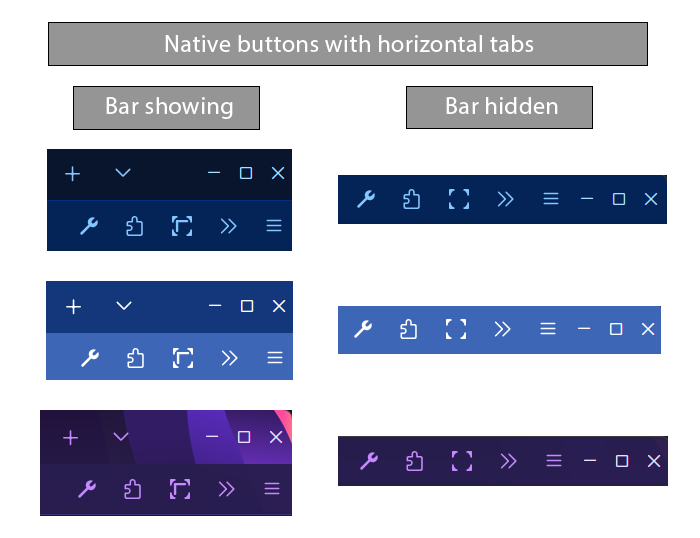
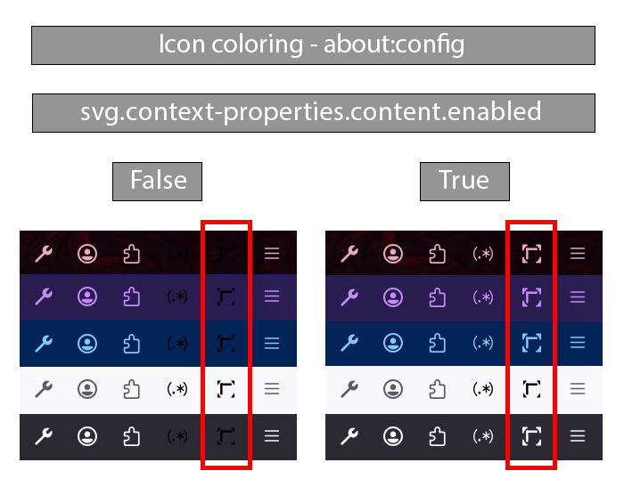

 
 
 


<!-- Can also get # of downloads per week:  https://img.shields.io/amo/dw/TST-Lock.svg?style=flat-square -->
<!-- Github badges:  https://shields.io/search?q=github -->
<!-- Mozilla badges:  https://shields.io/search?q=mozilla -->
<!-- https://shields.io/badges -->
<!-- https://github.com/badges/shields -->

**Companion for Sidebars:** Perfect for users of **Tree Style Tab**, **Sidebery**, or other vertical tab extensions.

How to use Toggle Native Tab Bar
================================


(REQUIRED) Enable userChrome.css in Firefox (Skip if already enabled)
----------------------------------------------------------------------------------------
1. In Firefox, type `about:config` into the address bar and press `Enter`.
2. Search for `toolkit.legacyUserProfileCustomizations.stylesheets` and set it to `TRUE` to enable custom stylesheets.
3. Next, type `about:profiles` into the address bar.
4. Find the profile labeled *"This is the profile in use and it cannot be deleted."*
5. In the same row, click **Open Folder** under *Root Directory* to access your profile folder.
6. In the profile folder, create a new folder named `chrome` (if it doesn’t already exist).
7. Inside the `chrome` folder, create a file named `userChrome.css` (ensure it’s not `userChrome.css.txt`).

These steps will enable custom styling with the `userChrome.css` file.

(REQUIRED) Enter CSS to hide or show the native tab bar in `userChrome.css`
---------------------------------------------

1. Open the `userChrome.css` file you created earlier in the `chrome` folder.
2. Add the one of these CSS solutions to your `userChrome.css` file:

### Handling horizontal tab bar (only)

#### FF133+: Current solution (RECOMMENDED)
   ```css
    #main-window[titlepreface*=" "] {
        #TabsToolbar {
            display: none;
        }

        #nav-bar {
            .titlebar-buttonbox-container {
                display: flex !important;
            }
        }
    }
   ```

#### FF133+: Original solution (which requires separate min/max/close buttons if desired)
   ```css
     #main-window[titlepreface*=" "] #TabsToolbar {
         display: none;
     }
   ```

#### Up to FF132: Legacy solution (Only if on FF132 or earlier)
```css
#main-window #titlebar {
    overflow: hidden;
    transition: height 0.3s 0.3s !important;
}

/* Hidden state: Hide native tabs strip */
#main-window[titlepreface*=" "] #titlebar { height: 0 !important; }

/* Hidden state: Fix z-index of active pinned tabs */
#main-window[titlepreface*=" "] #tabbrowser-tabs { z-index: 0 !important; }
```

### Handling horizontal and vertical tab bars (FF136+)

#### FF136+: Current solution (RECOMMENDED)
```css
#main-window[titlepreface*=" "] {
    #TabsToolbar {
        display: none;
    }

    #nav-bar {
        .titlebar-buttonbox-container {
            display: flex !important;
        }
    }
	
    #sidebar-main {
        display: none;
    }
}
```

#### FF136+: Original solution (which requires separate min/max/close buttons if desired)
```css
#main-window[titlepreface*=" "] {
    #TabsToolbar {
        display: none;
    }
	
    #sidebar-main {
        display: none;
    }
}
```

<div style="display: flex; align-items: center; margin-bottom: 10px; margin-top: 5px;">
    
</div>
3. Save your userChrome.css file and restart Firefox to apply the changes.

**Explanation**
- This CSS targets TabsToolbar and hides the native tab bar when a certain condition is met.
- The condition is based on the titlepreface property, which this add-on manipulates by adding or removing a space (" ").

**Reference**
- You can refer to Mozilla’s documentation for more details: [MDN WebExtensions API - windows.update](https://developer.mozilla.org/en-US/docs/Mozilla/Add-ons/WebExtensions/API/windows/update)

(LIMITATION) Limited access to window control buttons when native tabs are hidden
---------------------------------------------

*   When the native tabs are hidden, the minimize, maximize, and close buttons are not directly accessible. Here are some workarounds:
    *   Use the new CSS solution to keep the Firefox native min/max/close buttons.
    *   Use this addon to temporarily show the native tab bar and regain access to the native window control buttons.
    *   Use keyboard shortcuts:
        *   `Alt+Space, N` for minimize
        *   `Alt+Space, X` for maximize
    *   Right-click the taskbar and use the context menu options.
    *   Use `Windows Key + Arrow Keys` to move and resize the window.
    *   Download and use Firefox addons that emulate the window control buttons and place them on the toolbar:
        *   [Minimize the Window](https://addons.mozilla.org/en-US/firefox/addon/minimize-the-window/)
        *   [Maximize the Window](https://addons.mozilla.org/en-US/firefox/addon/maximize-the-window/)
        *   [Close the Window](https://addons.mozilla.org/en-US/firefox/addon/close-the-window/)
        *    -- These addons can replace the native buttons.


(INFO) Addon icon & Dynamic Coloring
---------------------------------------------

*   **Modern Minimalist Design:** The addon icon has been updated to a modern SVG design that visually represents both horizontal and vertical tab states.
*   **Dynamic Icon Color:** The addon now uses native SVG icons with `context-fill`. To allow the icon to automatically match your Firefox theme colors (staying visible on light, dark, or colorful themes), you must enable dynamic theme support:
    1. Go to `about:config`.
    2. Set `svg.context-properties.content.enabled` to **true**.

    > [!IMPORTANT]
    > **Action Required:** If you do not enable this setting, the addon icon will remain black regardless of your theme and will not adapt to light or dark modes.

    <div style="margin-top: 15px; margin-bottom: 20px;">
        
        <p><i>The icon color automatically adapts to match your browser theme's text color.</i></p>
    </div>

*   The toolbar icon changes to reflect the current state of the native tab bar:
    * <div style="display: flex; align-items: center; margin-bottom: 10px; margin-top: 5px;">
        
        <span>Indicates the native tab bar is currently <strong>visible</strong>. (Outer frame + tab line)</span>
      </div>
    * <div style="display: flex; align-items: center;">
        
        <span>Indicates the native tab bar is currently <strong>hidden</strong>. (Outer frame only)</span>
      </div>

Inspiration and credits
---------------------------------------------

*   This addon was inspired by Sidebery's *Dynamic Native Tabs* feature
    *   [Dynamic Native Tabs (Github Description)](https://github.com/mbnuqw/sidebery/wiki/Firefox-Styles-Snippets-(via-userChrome.css)#dynamic-native-tabs)
    *   While Sidebery focuses on whether its own sidebar is displayed, this addon toggles only the native tab bar.
    *   This allows both the sidebar and native tab bar to be shown simultaneously if desired.
    *   You do not even have to show your sidebar to use this addon.
    *   It also offers a more generic implementation that could work with other sidebar addons like *[Tree Style Tab](https://github.com/piroor/treestyletab)*.

*   Attribution for the base addon icon:
    *   Icons made by [Freepik](https://www.flaticon.com/authors/freepik "Freepik") from [www.flaticon.com](https://www.flaticon.com/ "Flaticon").

## Version History

<details open>
<summary><b>Version 0.9.6 (April 25, 2026) — Vertical Tabs Support & Dynamic Icon Coloring</b></summary>

- **Vertical Tabs Support**: Updated CSS instructions to support Firefox 136+ native vertical tabs.
- **Dynamic Icon Coloring**: Implemented dynamic SVG icons with `context-fill` to automatically match browser themes.
- **Project Reorganization**: Organized all project assets into logical directories (`icons/`, `ui/`, `options/`).
- **Build Modernization**: Transitioned to the official Mozilla `web-ext` tool for standardized building and linting.
- **Enhanced Options UI**: Redesigned the Options page with a modern, card-based responsive layout.
- **Optimization**: Reduced final XPI package size by 25% (compared to v0.9.5) through improved exclusion rules and asset optimization, despite adding new documentation and features.
- **Mozilla Compliance**: Added mandatory data collection permission flags to align with current Mozilla submission requirements.
- **UI Polish**: Added professional favicons to all internal extension pages.
</details>

<details>
<summary><b>Version 0.9.5 (January 12, 2025) — Native Button Support Documentation</b></summary>

- **Native Button Support**: Documented a new (optional) CSS solution that allows using native min/max/close buttons instead of emulated ones.
</details>

<details>
<summary><b>Version 0.9.4 (December 14, 2024) — Keyboard Shortcut Support</b></summary>

- **Keyboard Shortcut**: Added keyboard support with "Ctrl+Alt+T" as the default shortcut to toggle the tab bar.
</details>

<details>
<summary><b>Version 0.9.3 (November 3, 2024) — Improved Instructions & Formatting</b></summary>

- **Update Notifications**: Added Firefox 133 userChrome.css change instructions to be displayed after addon updates.
- **Dismissible Instructions**: Added a checkbox to disable showing installation instructions after an update until the next required change.
- **OS-Specific Guides**: Integrated better formatting and PC/Mac specific instructions for initial userChrome.css setup.
</details>

<details>
<summary><b>Version 0.9.2 (June 24, 2024) — Bug Fixes</b></summary>

- **Window Management**: Fixed a bug where creating a new window did not behave as expected.
</details>

<details>
<summary><b>Version 0.9.1 (March 11, 2024) — Technical Update</b></summary>

- **Compatibility Update**: Updated the internal title delimiter from "XXX" to " " for better compatibility.
</details>

<details>
<summary><b>Version 0.9.0 (March 11, 2024) — Initial Release</b></summary>

- **Core Functionality**: Toggles the native Firefox tab bar via title preface manipulation.
</details>
